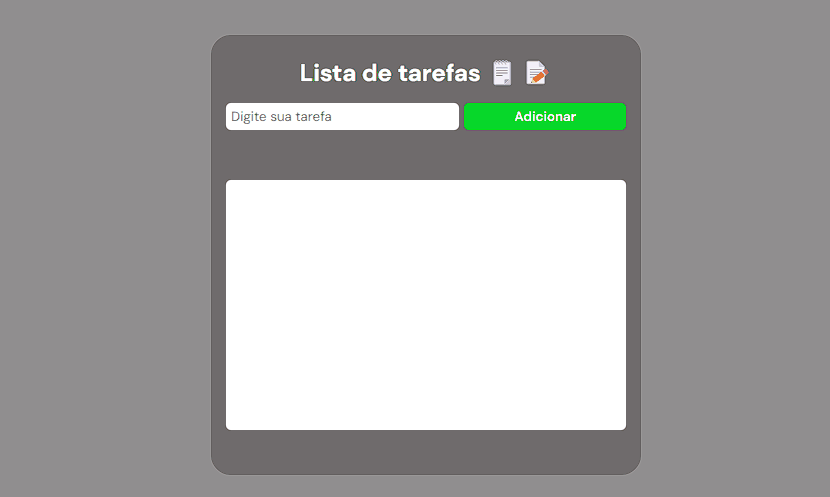

# Lista de Tarefas 📝😊

Mais um projeto, mais uma prática, a famosa "mão na massa", mais um desafio que me propus a fazer e testar minhas habilidades e conhecimento em front-end, houve momentos que senti dificuldades, mas fui persistindo e pesquisando,e no fim deu tudo certo e me trouxe mais confiança na hora de codar. O projeto é simples, porém funcional.

## Tecnologias Usadas

- HTML: Estrutura básica da aplicação.
- CSS: Estilização para criar um design simples e responsivo.
- JAVASCRIPT: Lógica para manipulação da lista de tarefas (adicionar, riscar e remover).

## Funcionalidades

- Caixa de input de texto, para digitar a tarefa.
- Botão para adicionar a tarefa.
- Checkbox para marcar/desmarcar tarefa, se marcada, tarefa será riscada.
- Botão de remover tarefa.
- Validação, caso o usuário não digite nada, há um alert pedindo que insira a tarefa.

#

Feito por Denis Vidal 🛜
